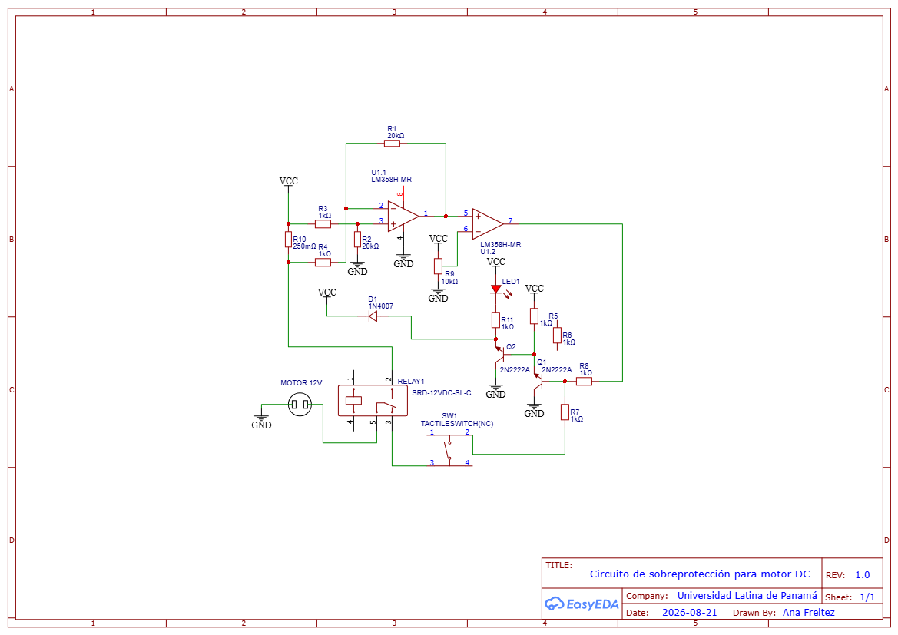

# ⚡ Analog Overcurrent Protector for DC Motors

<p align="center">

  

</p>

<p align="center">

  <b>Analog electronic protection for DC motors, with no microcontroller.</b>

</p>

<p align="center">

  

  

  

  

</p>

---

## 📌 What is this project about?

This project implements an **analog overcurrent protector for DC motors**. Its purpose is to detect when the current drawn by the motor exceeds an **adjustable threshold** and automatically disconnect the load to reduce the risk of damage.

The solution uses analog electronics, so it **does not depend on a microcontroller, firmware, or software during operation**.

The protection system is based on a simple chain:

**Current Sensing → Amplification → Comparison → Switching → Motor Disconnection**

When an overcurrent condition is detected, a **relay** interrupts the motor's power supply. The system also includes an **LED indicator**, protection against the relay's inductive voltage spike, and **manual reset using a push button**.

---

## 🎯 Objectives

- 🔎 Detect overcurrent conditions in a DC motor.

- 🎚️ Adjust the trip threshold using a potentiometer.

- ⚙️ Physically disconnect the motor when the configured limit is exceeded.

- 🛡️ Protect the switching stage against inductive voltage spikes.

- 💡 Visually indicate the protection status.

- 🔄 Allow manual reset after a trip.

- 🧪 Validate operation through design, simulation, and physical testing.

---

## 🧠 How does it work?

```mermaid
flowchart LR

    A[🔋 DC Power Supply] --> B[⚙️ DC Motor]

    B --> C[📏 Current Sensing]

    C --> D[📈 Amplification]

    D --> E[⚖️ Comparator]

    F[🎚️ Potentiometer<br/>Threshold] --> E

    E --> G[🔀 NPN Transistors]

    G --> H[🔌 Relay]

    H --> B

    G --> I[💡 Indicator LED]

    J[🔘 Push Button<br/>Reset] --> E